# Developing Python ROS in PyCharm

This is an example project to illustrate how use PyCharm as a fully integrated development environment (IDE) for a ROS
Python project by encapsulating the dependencies in a docker container.

## The turtle example

This example installs dependencies for the [`turtlesim`](http://wiki.ros.org/turtlesim) package on top of the base ROS
image. It defines a new package called [`turtle_example`](./turtle_example) with a simple Python node
called [`circler`](./turtle_example/scripts/circler) which publishes twist commands for a running turtlesim node to
drive it in a circle.

## Base ROS Docker images

The majority of the background work is done in the
repository [aica-technology/docker-images](https://github.com/aica-technology/docker-images). There, docker images are
defined for specific versions of ROS and ROS2 that contain all the necessary development dependencies, including an
inbuilt SSH server. PyCharm will use the SSH server to access the remote environment.

To begin, clone the [docker-images](https://github.com/aica-technology/docker-images) repository to have access to the
helper scripts and additionally pull the ROS workspace image with

```bash
docker pull ghcr.io/aica-technology/ros-ws:noetic
```

## PyCharm setup

Prerequisites: Docker, PyCharm Professional 2021 or newer, base ROS docker image from AICA

**Step 1:** Build the docker image with `docker build -t domire8/ros-pycharm-example .`

**Step 2:** Use the [`server.sh` script](https://github.com/aica-technology/docker-images/blob/master/scripts/server.sh)
in the aica-technology/docker-images repository to start a background container for the appropriate user with a desired
port number.

In this example, we will use user `ros` for a noetic version image. We will also choose to use port 3456, though the
specific number does not matter.

```shell script
path/to/aica-technology/docker-images/scripts/server.sh domire8/ros-pycharm-example --user ros --port 3456
```

**Step 3:** Open this directory in PyCharm or via command line

```bash
cd path/to/ros-pycharm-example && pycharm-professional .
```

**Step 4:** Go to `File` &rarr; `Settings` &rarr; `Project: ros-pycharm-example` &rarr; `Python Interpreter` and choose
the option to add a new interpreter.

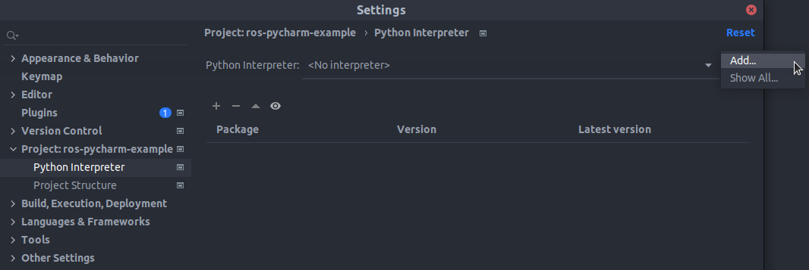

**Step 5:** Choose to add a new `SSH Interpreter`, enter the server configuration as shown in the picture below, and
click next. There might be a warning popping up if you want to continue connecting to the SSH server. Confirm with yes.

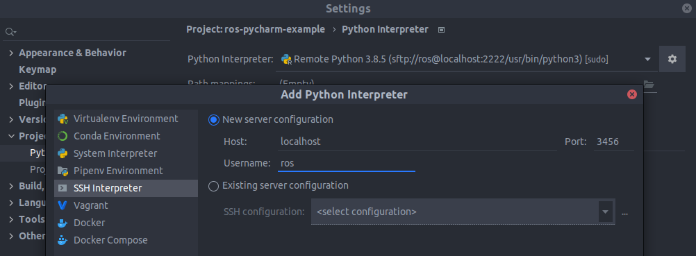

**Step 6:** In the next window, change the interpreter path to `/usr/bin/python3` and make sure that the option
*Automatically upload project files to the server* is activated. Do not worry about the rest for now and click finish.

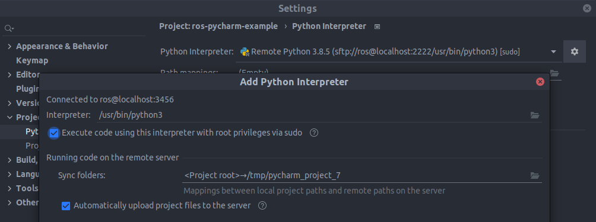

**Step 7:** Go to `File` &rarr; `Settings` &rarr; `Build, Execution & Deployment` &rarr; `Deployment`. The created ssh
connection should now show up with type *SFTP*. Click on `AUTODETECT` in the connection tab. You should see `/home/ros`.

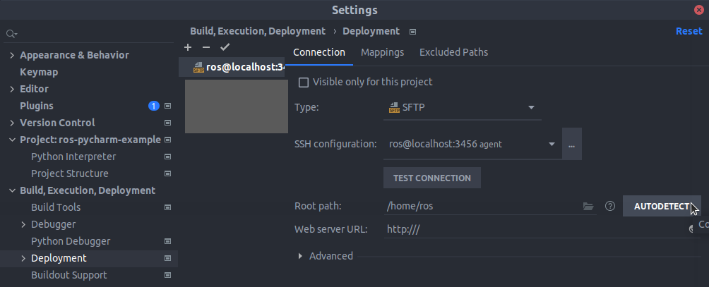

**Step 8:** In the mappings tab, change the local path, deployment path, and web path as shown in the picture below.
These steps make sure that the syncing of files between the host and server is correct. Click apply, and finally make
sure that the new connection is used as default (`ros@localhost:3456` in the list of connections should be bold,
otherwise use the tick above to set it as default).

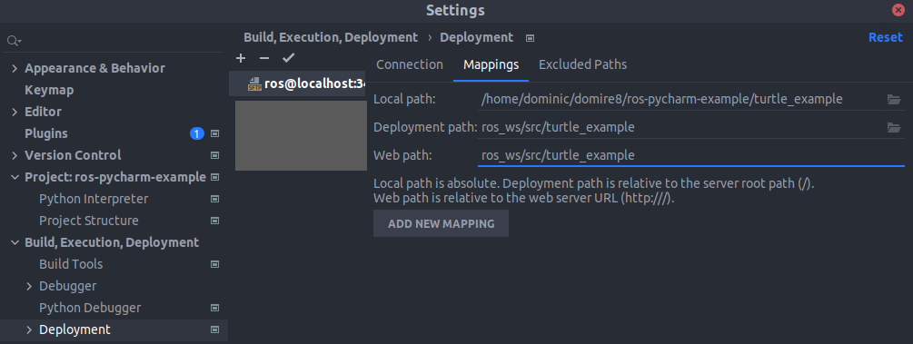

**Step 9:** Finally, go to `File` &rarr; `Settings` &rarr; `Build, Execution & Deployment` &rarr; `Deployment`
&rarr; `Options` and change to `Yes` under *Preserve original file permissions (SFTP only)*. Apply and close.

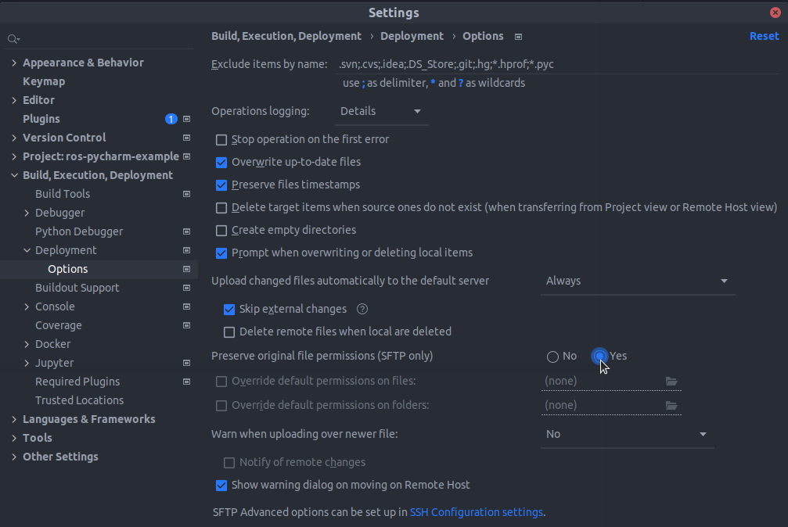

**Step 10 (for testing):** Right-click on your project folder, go to *Deployment* and click on *Upload to ros@localhost:
3456*. You should get a message in green saying that the files have been transferred.

**Step 11 (optional):** This example can easily be extended to a project with several ROS packages. Assuming a folder
structure like

```bash
ros-pycharm-example
   └──source
       ├──package1
       └──package2
```

you would just need to `Add new mapping` in step 8 such that you have one mapping per package. Additionally, after you
have built the package(s) the first time, you can go to `File` &rarr; `Settings` &rarr; `Project: ros-pycharm-example`
&rarr; `Python Interpreter` and choose *Show All*.

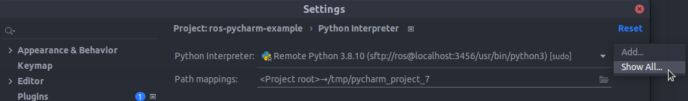

Then, select your new interpreter and click on *Show paths for selected interpreter* and then click on the plus.

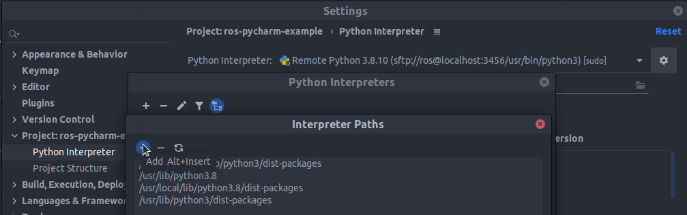

Finally, choose to add `/home/ros/ros_ws/devel/lib/python3/dist-packages` as additional remote path. This will enable
full IDE capabilities even for the package(s) currently under development in the project.

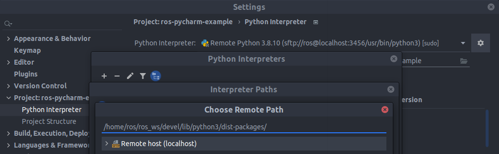

## Using the example

Once the server is running in the background, you can use
the [`connect.sh` script](https://github.com/aica-technology/docker-images/blob/master/scripts/connect.sh)
to attach new terminal windows by specifying the container name and user. You can use `docker container ls` to look up
the names of running containers. In the case of this example:

```shell script
path/to/aica-technology/docker-images/scripts/connect.sh domire8-ros-pycharm-example-ssh --user ros
```

Note that for GUI applications through Docker on MacOS, you will need to follow the additional
[display forwarding instructions](https://github.com/aica-technology/docker-images#notes-on-x11-display-forwarding-for-mac)
in the docker-images repository.

### Running the example outside the IDE

Using three terminals, invoke `roscore` in one, then `rosrun turtlesim turtlesim_node` in a second, and finally
`rosrun turtle_example circler` in the third. You should see the turtle begin to swim in circles.

You can also simply use one terminal and invoke `roslaunch turtle_example circler.launch` directly.

With the PyCharm environment established as explained above and automatic upload to the server enabled, you can modify
the code in `circler`, press save, go to the connected terminal, and immediately do `rosrun turtle_example circler` to
see the changes.

### Running and debugging the example within the IDE

Code insight and completion are just two advantages of configuring the Python interpreter in the IDE. Another big
advantage is that you can actually run and **debug** your code from within the IDE. To do this, follow these steps:

1. Using two terminals, invoke `roscore` in one, and `rosrun turtlesim turtlesim_node` in the other one. You should see
   the turtle in the bottom left corner of the window (not moving yet).
2. Go to the `circler.py` script and press the play button next to the line `if __name__ == '__main__':`. This won't
   work the first time around. But it will create a configuration *CIRCLER* that you should be able to see in the top
   right corner of PyCharm (see picture below). If this is not the case, activate `View` &rarr; `Appearance`
   &rarr; `Navigation Bar`.
   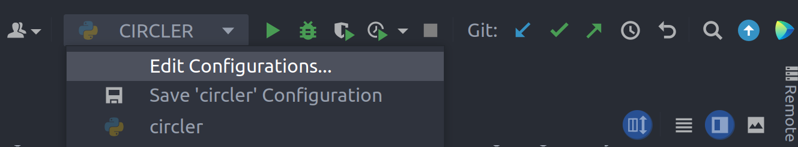
3. Click on *CIRCLER*  &rarr; `Edit Configurations`. Under `Environment` &rarr; `Environment Variables` click on
   `Edit environment variables` and add an environment variable with
    - Name: PYTHONPATH
    - Value: $PYTHONPATH:/opt/ros/noetic/lib/python3/dist-packages:/home/ros/ros_ws/devel/lib/python3/dist-packages

   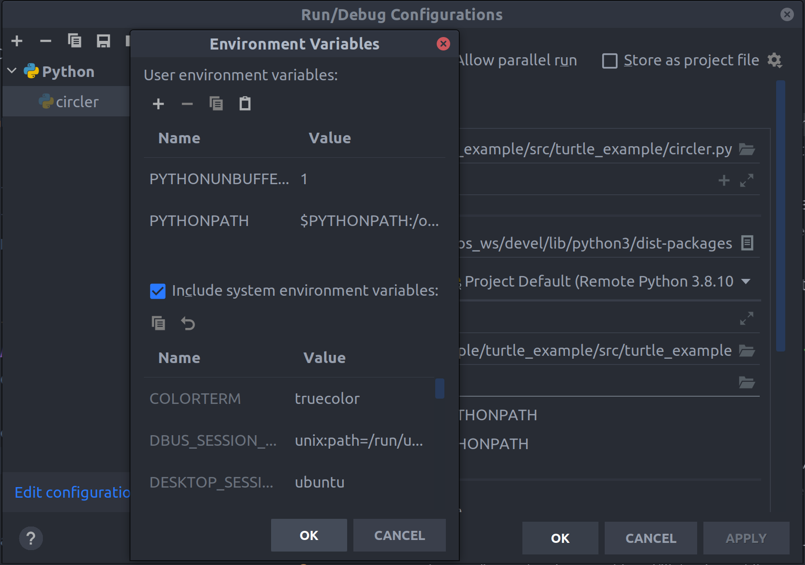
5. Apply the settings and close the window. Then, you can use the play and debug icons to execute the script either in
   run or debug mode. For more information on debugging with PyCharm,
   visit [this](https://www.jetbrains.com/help/pycharm/debugging-your-first-python-application.html) website.

## Credits

Credits for the code of this example go to **[@eeberhard](https://github.com/eeberhard)** and his
equivalent [C++/CLion example](https://github.com/eeberhard/ros-clion-example).
